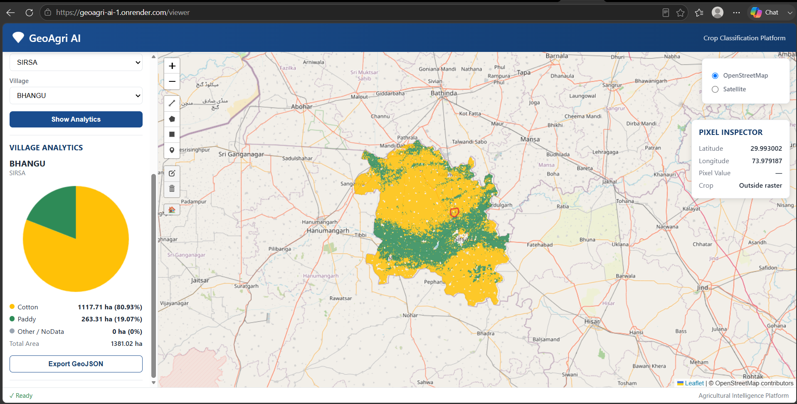

# 🌾 GeoAgri AI
> A production-ready Geospatial AI dashboard for visualizing crop classification maps, village analytics, and GIS layers using FastAPI, Rasterio, GeoPandas, and Leaflet.

> AI-powered Geospatial Crop Classification & Village Analytics Dashboard


---

## 🌐 Live Demo

### Dashboard
👉 https://geoagri-ai-1.onrender.com/

### Interactive Viewer
👉 https://geoagri-ai-1.onrender.com/viewer

### API Endpoints

| Endpoint | Description |
|----------|-------------|
| `/` | Application Status |
| `/viewer` | Interactive GIS Viewer |
| `/info` | Raster Information |
| `/layers` | Available Layers |
| `/health` | Health Check |

---

# Project Overview

GeoAgri AI is a cloud-based GIS web application developed using FastAPI, Rasterio, GeoPandas, and Leaflet for visualization of crop classification maps generated from satellite imagery.

The application allows users to:

- Visualize crop classification raster
- Search villages
- Display district boundaries
- Display village boundaries
- View village-wise crop statistics
- Export GeoJSON
- Access raster metadata
- View satellite and OpenStreetMap basemaps

---

# Features

✅ Cloud Optimized GeoTIFF (COG)

✅ Interactive Leaflet Map

✅ Village Search

✅ Village Analytics

✅ District Boundary

✅ Village Boundary

✅ Raster Tile Service

✅ REST APIs

✅ FastAPI Backend

✅ Render Cloud Deployment

---

# Technology Stack

## Backend

- FastAPI
- Rasterio
- GeoPandas
- Fiona
- Rio-Tiler
- Jinja2

## Frontend

- HTML
- CSS
- JavaScript
- Leaflet.js

## GIS

- GeoTIFF
- Cloud Optimized GeoTIFF (COG)
- ESRI Shapefile

## Deployment

- Render
- GitHub

---

# Dataset

State: Haryana

Village Database: 7,006 Villages

Raster Size:

- Width : 4038
- Height : 4254

Projection:

WGS84 (EPSG:4326)


## Dashboard



## GIS Viewer


# Installation

Clone repository

```bash
git clone https://github.com/dubeyamit1212-collab/GeoAgri-AI.git
```

Install packages

```bash
pip install -r requirements.txt
```

Run application

```bash
uvicorn main:app --reload
```

Open browser

```
http://127.0.0.1:8000/viewer
```

---

# Project Structure

```
GeoAgri-AI
│
├── data
│   ├── district_crop_map_COG.tif
│   └── HARYANA
│
├── static
│   ├── css
│   └── js
│
├── templates
│   └── viewer.html
│
├── uploads
│
├── main.py
├── requirements.txt
└── README.md
```

---

# Future Improvements

- User Authentication
- Multi-state Support
- Time Series Visualization
- ML Model Integration
- AI-based Crop Recommendation
- Dashboard Analytics
- Mobile Responsive UI

---

# Author

**Amit Dubey**

GIS Analyst | Remote Sensing | Geospatial AI | Python | FastAPI

GitHub:

https://github.com/dubeyamit1212-collab

---

# License

MIT License

---

⭐ If you like this project, don't forget to star the repository.


